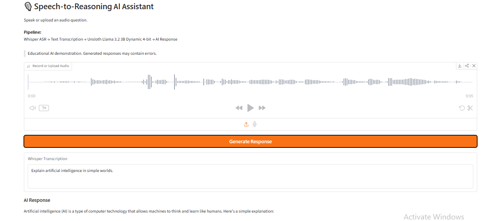
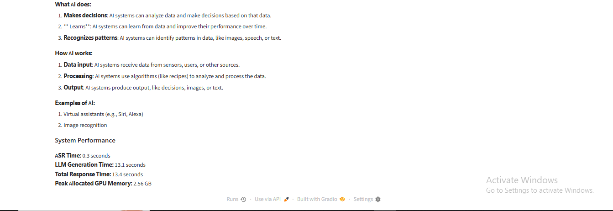
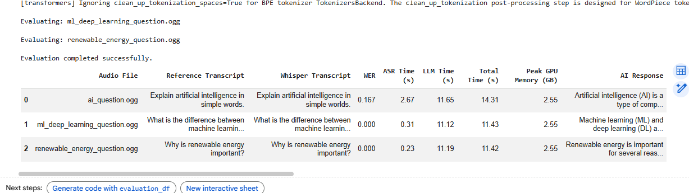
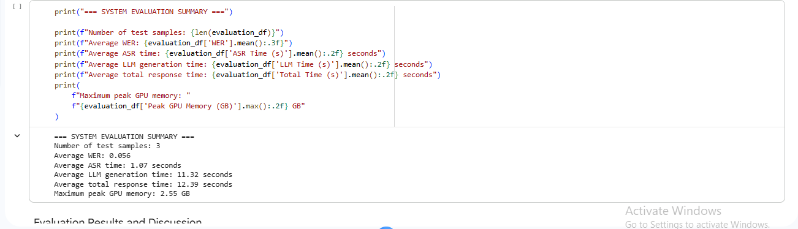

# 🎙️ Speech-to-Reasoning AI Assistant

### Task 4 — Generative AI Internship at Arch Technologies

An end-to-end **Speech-to-Reasoning AI pipeline** that converts spoken questions into text using **OpenAI Whisper** and generates natural-language responses using an **Unsloth Llama 3.2 3B Dynamic 4-bit** language model.

The project also includes an interactive **Gradio interface**, Word Error Rate evaluation, latency measurement, and GPU-memory monitoring.

---

## 🚀 Project Overview

This project demonstrates how automatic speech recognition and memory-efficient Large Language Model inference can be integrated into a complete voice-based AI application.

**Pipeline:**

**Voice Input → Whisper ASR → Text Transcription → Quantized LLM → AI Response**

A user can record or upload an audio question. Whisper converts the speech into text, and the transcription is passed to the quantized Llama model for response generation.

---

## ✨ Key Features

- 🎤 Record speech or upload an audio file
- 📝 Speech-to-text transcription using OpenAI Whisper
- 🤖 AI response generation using Llama 3.2 3B
- ⚡ Memory-efficient 4-bit quantized inference
- 🖥️ Interactive Gradio web interface
- 📊 Word Error Rate (WER) evaluation
- ⏱️ ASR latency measurement
- ⏱️ LLM generation latency measurement
- ⏱️ End-to-end response-time measurement
- 💾 Peak GPU-memory monitoring

---

## 🧠 System Architecture

**User Voice Query**  
↓  
**OpenAI Whisper ASR**  
↓  
**Speech-to-Text Transcription**  
↓  
**Unsloth Llama 3.2 3B Dynamic 4-bit**  
↓  
**AI Generated Response**

### Main Components

- **OpenAI Whisper Base** — automatic speech recognition
- **Unsloth Llama 3.2 3B Instruct Dynamic 4-bit** — response generation
- **Hugging Face Transformers** — model loading and inference
- **PyTorch** — GPU-based computation
- **bitsandbytes** — memory-efficient 4-bit model support
- **Gradio** — interactive application interface
- **JiWER** — Word Error Rate calculation
- **Pandas** — evaluation-results organization

---

## 📊 System Evaluation

The system was evaluated using three independently recorded voice queries covering:

- Artificial Intelligence
- Machine Learning vs. Deep Learning
- Renewable Energy

### Evaluation Summary

| Metric | Result |
| --- | ---: |
| Number of Test Samples | 3 |
| Average WER | 0.056 |
| Average ASR Time | 0.56 s |
| Average LLM Generation Time | 19.77 s |
| Average End-to-End Response Time | 20.34 s |
| Maximum Peak GPU Memory | 2.55 GB |

Two of the three evaluation samples produced exact normalized Whisper transcriptions, while one contained a minor word-level transcription difference.

Because the evaluation contains only three manually recorded samples, these results demonstrate pipeline functionality rather than general model performance.

---

## 🖼️ Application Demo

### Gradio Interface

The application accepts recorded or uploaded speech and displays the Whisper transcription and generated AI response.

### AI Response and System Performance

The interface also reports ASR time, LLM generation time, total response time, and peak allocated GPU memory.

---

## 📈 Evaluation Results

The following table screenshot shows the three evaluated audio samples and their measured results.

### Evaluation Summary Output

---

## 🛠️ Technologies Used

- Python
- PyTorch
- OpenAI Whisper
- Hugging Face Transformers
- Unsloth Llama 3.2 3B Dynamic 4-bit
- bitsandbytes
- accelerate
- Gradio
- JiWER
- Pandas
- Librosa
- SoundFile
- SentencePiece
- Google Colab
- NVIDIA Tesla T4 GPU

---

## 📁 Repository Structure

- `Speech_to_Reasoning_Whisper_Unsloth_4bit.ipynb` — complete project notebook
- `requirements.txt` — required Python libraries
- `README.md` — project documentation
- `LICENSE` — MIT License
- `.gitignore` — Python Git ignore rules
- `assets/`
  - `gradio_demo.png`
  - `gradio_performance.png`
  - `evaluation_results.png`
  - `evaluation_summary.png`

---

## ▶️ How to Run the Project

1. Clone the repository:

   `git clone https://github.com/Kaunaingul-ai/speech-to-reasoning-whisper-unsloth-4bit.git`

2. Open the repository folder:

   `cd speech-to-reasoning-whisper-unsloth-4bit`

3. Install the required packages:

   `pip install -r requirements.txt`

4. Open `Speech_to_Reasoning_Whisper_Unsloth_4bit.ipynb` in **Google Colab**.

5. Enable a GPU runtime.

6. Run the notebook cells sequentially.

The notebook will:

- check the GPU environment
- install and import dependencies
- load Whisper
- load the quantized Llama model
- build the Speech-to-Reasoning pipeline
- evaluate the system
- launch the Gradio application

> **Note:** The public `gradio.live` URL created in Google Colab is temporary, so it is not included as a permanent deployment link.

---

## 📦 Requirements

The main packages used are:

- `torch`
- `transformers`
- `accelerate`
- `bitsandbytes`
- `openai-whisper`
- `sentencepiece`
- `librosa`
- `soundfile`
- `jiwer`
- `pandas`
- `gradio`

The full list is available in `requirements.txt`.

---

## ⚠️ Limitations

- Speech-recognition quality may decrease with background noise, microphone quality, accents, or longer recordings.
- The evaluation contains only three manually recorded voice queries.
- Large Language Models may generate incomplete or factually incorrect responses.
- LLM generation contributes most of the current end-to-end latency.
- The Gradio public URL generated through Google Colab is temporary.
- The application is an educational AI prototype and should not replace professional advice in high-stakes domains.

---

## 🔮 Future Improvements

Future development could include:

- Larger and more diverse speech datasets
- Multilingual speech recognition
- Support for additional accents and languages
- Faster LLM inference
- Improved response validation
- Streaming speech processing
- Real-time conversational interaction
- Permanent web deployment
- More comprehensive response-quality evaluation

---

## 🎓 Internship Project

This project was completed as **Task 4 of the Generative AI Internship at Arch Technologies**.

The task provided hands-on experience with:

- Automatic Speech Recognition
- Quantized Large Language Models
- Speech-to-Reasoning pipelines
- GPU-efficient inference
- Word Error Rate evaluation
- Latency and memory measurement
- Gradio application development
- End-to-end Generative AI system design

---

## 👩‍💻 Author

**Kaunain Gul Khalid**  
BS Artificial Intelligence  
University of Malakand

---

## 📄 License

This project is licensed under the **MIT License**.

---

⭐ If you find this project useful, feel free to explore the notebook and experiment with the Speech-to-Reasoning pipeline.
